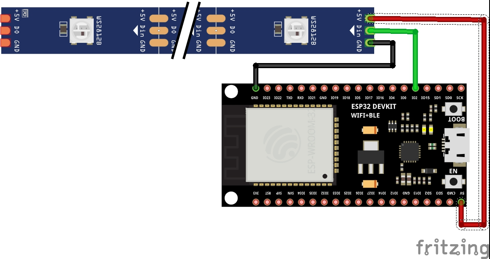
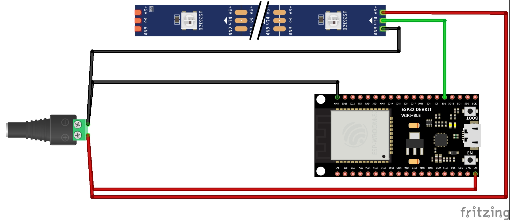
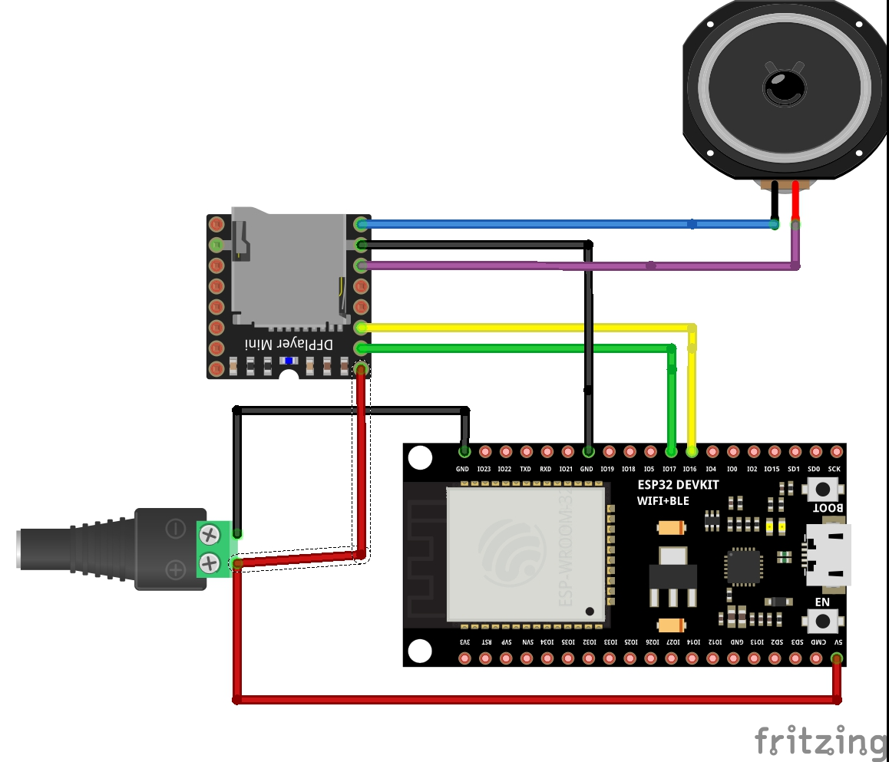
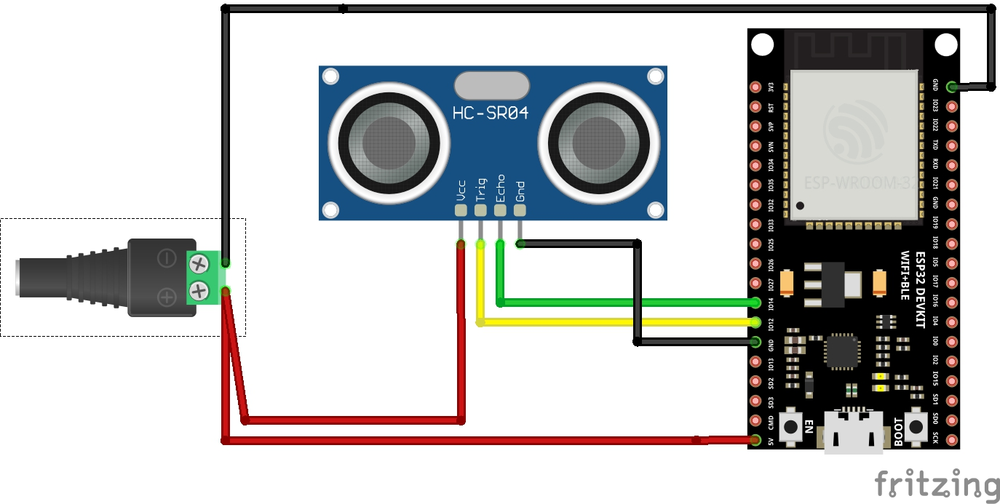
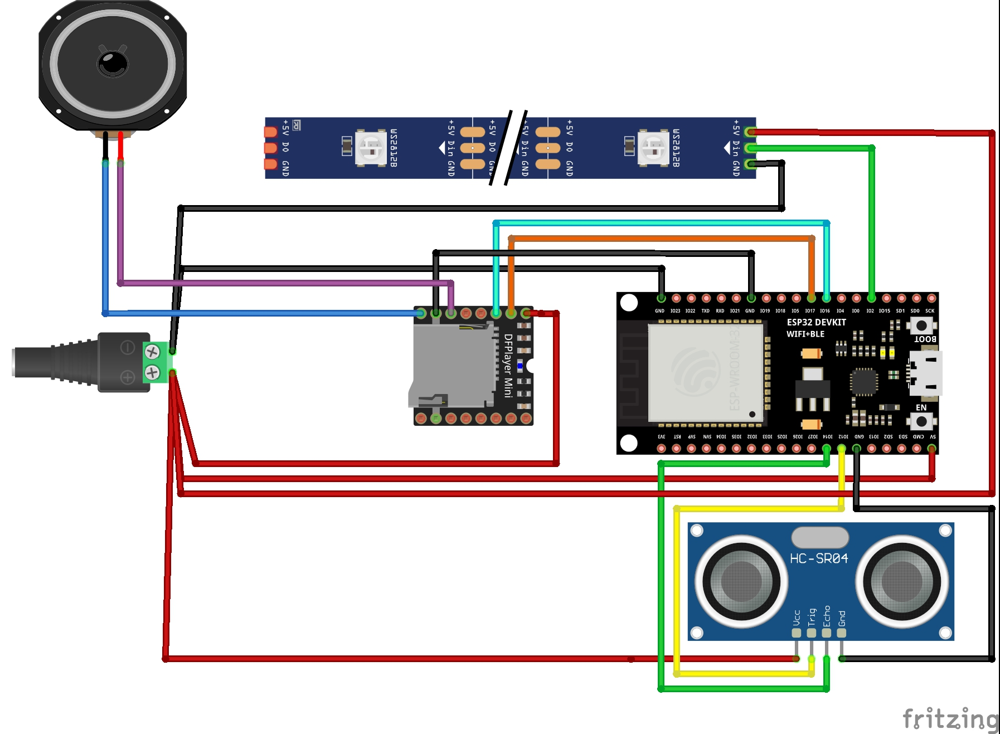

# L3D
L3D est un séquenceur d'effets sur bandeau de Led.

1. [Fonctionnement](#fonctionnement)
2. [Montage](#montage)
3. [Connexion](#connexion)
4. [Flashage](#flashage)
5. [Mise à jour par OTA](#mise-%C3%A0-jour-ota)
   
## Fonctionnement 
L3D permet de :
 * créer des séquences visuelles qui appliquent chacune un effet sur un segment
 * découper virtuellement le bandeau en plusieurs zones (des segments), qui peuvent se superposer si besoin.
 * il peut y avoir 8 séquences en même temps
 * il est possible de déclencher des sons à un instant donné
 * le programmme peut démarrer/s'arrêter avec à un capteur/bouton
 * tout est configurable depuis une page web

Une séquence est composée :
 * d'un effet
 * de réglages de l'effet (couleurs, rapidité)
 * d'un temps de début
 * d'une durée

Les sons sont stockés en MP3 sur une carte SD sur le DFMiniPlayer (max 32Go).\
Les fichiers doivent être numérotés avec 4 chiffres, 0001.mp3, 0002.mp3, ...

Seul le capteur ultrason HC-SR04 est géré pour le moment.

## Montage

### Led Strip WS2812B sans alimentation (6/8 Leds)
Pin 2 utilisée pour le signal Data vers le Led Strip

### Led Strip WS2812B uniquement
Pin 2 utilisée pour le signal Data vers le Led Strip

### DFMiniPlayer uniquement
Carte SD de 32Go maximum, les fichiers doivent être numérotés à 4 chiffres 0001.mp3, 0002.mp3, ....\
Pin 16 vers TX du DFMiniPlayer\
Pin 17 vers RX du DFMiniPlayer

### HC-SR04 uniquement
Pin 12 vers Trig du capteur HC-SR04\
Pin 14 vers Echo du capteur HC-SR04

### Leds Strip WS2812B, DFMiniPlayer, HC-SR04
Carte SD de 32Go maximum, les fichiers doivent être numérotés à 4 chiffres 0001.mp3, 0002.mp3, ....\
Pin 2 utilisée pour le signal Data vers le Led Strip\
Pin 16 vers TX du DFMiniPlayer\
Pin 17 vers RX du DFMiniPlayer\
Pin 12 vers Trig du capteur HC-SR04\
Pin 14 vers Echo du capteur HC-SR04

## Connexion

Une fois connectée sur votre réseau Wifi la carte se retrouve par défaut à l'adresse http://l3d.local \
En cas de problème de connexion wifi la carte va démarrer en mode AP (Acces Point). Elle se comporte comme une borne wifi sur laquelle vous pouvez vous connecter\
ssid : L3DAP\
mot de passe : tonystark\
Se connecter ensuite sur http://7.7.7.7 parfois http://192.168.4.1 

## Flashage

Pour flasher la carte avec le programme au complet il suffit de suivre le lien suivant et suivre la procédure.\
Après flashage la carte va redémarrer et l'installeur Web va proposer de connecter la carte à votre wifi.

Le Web installeur se trouve à \
https://demande-a-fred.github.io/L3D/esp.html

**Attention TOUTES les données présentes sur la carte seront éffacées**

Lors du tout premier flashage il est possible que la carte n'apparaisse pas si le pilote de la carte n'est pas installé sur votre machine.\
La page de mise à jour propose de télécharger des pilotes.\
Suivez le lien de téléchargement proposé par l'installeur, installez les pilotes et ouvez à nouveau le lien de flashage au dessus.\
Pour les ESP de chez AZ Delivery c'est le CP2102 (le premier lien)

## Mise à jour OTA

Il est possible de faire des mises à jour à distance (sans cable) après que la carte ait été flashée une première fois par l'outil web.\
Il suffit d'ouvrir votre navigateur sur la carte concernée (par adresse http://ip.de.la.carte ou par son nom, par défaut http://l3d.local). Allez dans l'onglet **Configuration** puis dans la section **Mise à jour OTA**.\

   
### Firmware

Télécharger le nouveau firmware depuis le dossier **OTA** de cette page Github.
Sur la page de mise à jour OTA de la carte, selectionner **"Firmware"** puis le glisser/déposer dans la fenêtre de mise à jour et suivre le reste de la procédure.

Les données de réglages, de configuration, et de séquences seront conservées.

### Filesystem
**Uniquement pendant la phase de test**\
Il est possible de faire la mise à jour de la partie Web de la carte par cette même page OTA.

Télécharger le nouveau Filesystem depuis le dossier **OTA** de cette page Github.\
Sur la page de mise à jour OTA de la carte, selectionner **"Filesystem"** puis le glisser/déposer dans la fenêtre de mise à jour et suivre le reste de la procédure.

**Attention TOUTES les données présentes sur la carte seront éffacées**\
*Les fichiers Web seront placés dans le code une fois qu'ils auront passé les phases de test et il ne sera plus possible de faire des mises à jour de Filesystem et ainsi de perdre donc les réglages.\
Leur mise à jour se fera en même temps que le reste du firmware\
Il est toujours possible d'éffacer les fichiers de réglages de la carte par la page de configuration*
